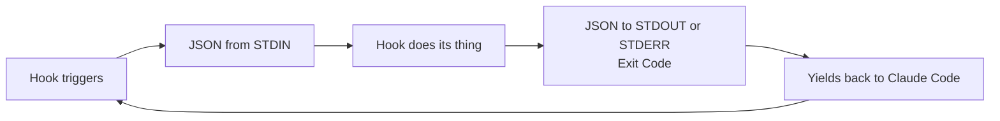
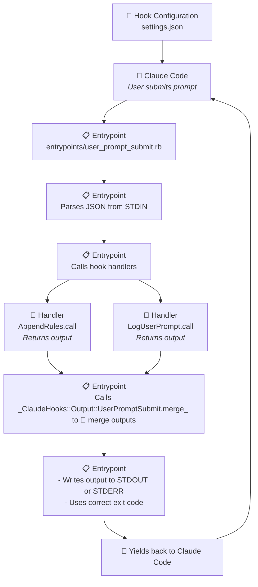

# Ruby DSL for Claude Code hooks

> [!IMPORTANT]
> v1.2.0 just released and is introducing a great number of changes. Please read the [CHANGELOG](CHANGELOG.md) for more information.


A Ruby DSL (Domain Specific Language) for creating Claude Code hooks. This will hopefully make creating and configuring new hooks way easier.

[**Why use this instead of writing bash, or simple ruby scripts?**](docs/WHY.md)

> You might also be interested in my other project, a [Claude Code statusline](https://github.com/gabriel-dehan/claude_monitor_statusline) that shows your Claude usage in realtime, inside Claude Code ✨.


## 📖 Table of Contents

- [Ruby DSL for Claude Code hooks](#ruby-dsl-for-claude-code-hooks)
  - [📖 Table of Contents](#-table-of-contents)
  - [🚀 Quick Start](#-quick-start)
  - [📦 Installation](#-installation)
  - [🏗️ Architecture](#️-architecture)
  - [🪝 Hook Types](#-hook-types)
  - [🚀 Claude Hook Flow](#-claude-hook-flow)
  - [📚 API Reference](#-api-reference)
  - [📝 Example: Tool usage monitor](#-example-tool-usage-monitor)
  - [🔄 Hook Output](#-hook-output)
  - [🔌 Plugin Hooks Support](#-plugin-hooks-support)
  - [🛠️ MCP Tools Integration](#️-mcp-tools-integration)
  - [🚨 Advices](#-advices)
  - [⚠️ Troubleshooting](#️-troubleshooting)
  - [🧪 CLI Debugging](#-cli-debugging)
  - [🐛 Debugging](#-debugging)
  - [🧪 Development \& Contributing](#-development--contributing)

## 🚀 Quick Start

> [!TIP]
> Examples are available in [`example_dotclaude/hooks/`](example_dotclaude/hooks/). The GithubGuard in particular is a good example of a solid hook. You can also check [Kyle's hooks for some great examples](https://github.com/kylesnowschwartz/dotfiles/blob/main/claude/hooks)

Claude Code supports two types of hooks:
- **Command hooks** (`type: "command"`) - Execute Ruby/bash scripts (what this DSL is for)
- **Prompt-based hooks** (`type: "prompt"`) - Delegate decisions to an LLM ([see guide](docs/PROMPT_BASED_HOOKS.md))

Here's how to create a simple command hook with this DSL:

1. **Install the gem:**
```bash
  gem install claude_hooks
```

1. **Create a simple hook script**
```ruby
#!/usr/bin/env ruby
require 'claude_hooks'

class AddContextAfterPrompt < ClaudeHooks::UserPromptSubmit
  def call
    log "User asked: #{prompt}"
    add_context!("Remember to be extra helpful!")
    output
  end
end

ClaudeHooks::CLI.run_hook(AddContextAfterPrompt)
```

3. ⚠️ **Make it executable**
```bash
chmod +x add_context_after_prompt.rb
# Test it
echo '{"session_id":"test","prompt":"Hello!"}' | ./add_context_after_prompt.rb
```

4. **Register it in your `.claude/settings.json`**
```json
{
  "hooks": {
    "UserPromptSubmit": [{
      "matcher": "",
      "hooks": [
        {
          "type": "command",
          "command": "path/to/your/hook.rb"
        }
      ]
    }]
  }
}
```
That's it! Your hook will now add context to every user prompt. 🎉

> [!TIP]
> Need to run multiple hooks for the same event and merge their outputs? See [Multi-hook structure](#multi-hook-structure) below.

## 📦 Installation

### Install it globally (simpler):

```bash
$ gem install claude_hooks
```

### Using a Gemfile

> [!WARNING]
> Unless you use `bundle exec` in the command in your `.claude/settings.json`, Claude Code will use the system-installed gem, not the bundled version.

Add it to your Gemfile (you can add a Gemfile in your `.claude` directory if needed):

```ruby
# .claude/Gemfile
source 'https://rubygems.org'

gem 'claude_hooks'
```

And then run:

```bash
$ bundle install
```

### 🔧 Configuration

Claude Hooks supports both home-level (`$HOME/.claude`) and project-level (`$CLAUDE_PROJECT_DIR/.claude`) directories. Claude Hooks specific config files (`config/config.json`) found in either directory will be merged together.

| Directory | Description | Purpose |
|-----------|-------------|---------|
| `$HOME/.claude` | Home Claude directory | Global user settings and logs |
| `$CLAUDE_PROJECT_DIR/.claude` | Project Claude directory | Project-specific settings |

> [!NOTE]
> Logs always go to `$HOME/.claude/{logDirectory}`

#### Environment Variables

You can configure Claude Hooks through environment variables with the `RUBY_CLAUDE_HOOKS_` prefix:

```bash
# Existing configuration options
export RUBY_CLAUDE_HOOKS_LOG_DIR="logs"                  # Default: logs (relative to $HOME/.claude)
export RUBY_CLAUDE_HOOKS_CONFIG_MERGE_STRATEGY="project" # Config merge strategy: "project" or "home", default: "project"
export RUBY_CLAUDE_HOOKS_BASE_DIR="~/.claude"            # DEPRECATED: fallback base directory

# Any variable prefixed with RUBY_CLAUDE_HOOKS_
# will also be available through the config object
export RUBY_CLAUDE_HOOKS_API_KEY="your-api-key"
export RUBY_CLAUDE_HOOKS_DEBUG_MODE="true"
export RUBY_CLAUDE_HOOKS_USER_NAME="Gabriel"
```

#### Configuration Files

You can also use configuration files in any of the two locations:

**Home config** (`$HOME/.claude/config/config.json`):
```json
{
  // Existing configuration option
  "logDirectory": "logs",
  // Custom configuration options
  "apiKey": "your-global-api-key",
  "userName": "Gabriel"
}
```

**Project config** (`$CLAUDE_PROJECT_DIR/.claude/config/config.json`):
```json
{
  // Custom configuration option
  "projectSpecificConfig": "someValue",
}
```

#### Configuration Merging

When both config files exist, they will be merged with configurable precedence:

- **Default (`project`)**: Project config values override home config values
- **Home precedence (`home`)**: Home config values override project config values

Set merge strategy: `export RUBY_CLAUDE_HOOKS_CONFIG_MERGE_STRATEGY="home" | "project"` (default: "project")

> [!WARNING]
> Environment Variables > Merged Config Files

#### Accessing Configuration Variables

You can access any configuration value in your handlers:

```ruby
class MyHandler < ClaudeHooks::UserPromptSubmit
  def call
    # Access directory paths
    log "Home Claude dir: #{home_claude_dir}"
    log "Project Claude dir: #{project_claude_dir}" # nil if CLAUDE_PROJECT_DIR not set
    log "Base dir (deprecated): #{base_dir}"
    log "Logs dir: #{config.logs_directory}"

    # Path utilities
    log "Home config path: #{home_path_for('config')}"
    log "Project hooks path: #{project_path_for('hooks')}" # nil if no project dir

    # Access custom config via method calls
    log "API Key: #{config.api_key}"
    log "Debug mode: #{config.debug_mode}"
    log "User: #{config.user_name}"

    # Or use get_config_value for more control
    user_name = config.get_config_value('USER_NAME', 'userName')
    log "Username: #{user_name}"

    output
  end
end
```

## 🏗️ Architecture

### Core Components

1. **`ClaudeHooks::Base`** - Base class with common functionality (logging, config, validation)
2. **Hook Classes** - One class per event type (`ClaudeHooks::UserPromptSubmit`, `ClaudeHooks::PreToolUse`, etc.) that you can inherit from in your hook scripts
3. **Output Classes**: those hook classes return instances of output objects (`ClaudeHooks::Output::UserPromptSubmit`, etc.) that handle intelligent merging of multiple outputs, correct exit codes, and routing to `STDOUT` or `STDERR` depending on hook state
4. **`ClaudeHooks::CLI`** - Entrypoint helpers: `CLI.run_hook` for production, `CLI.test_runner`/`CLI.run_with_sample_data` for local testing
5. **Configuration** - Shared configuration management via `ClaudeHooks::Configuration`
6. **Logger** - Dedicated logging class with multiline block support

### Hook file structure

For simple cases like one hook class per event, a single file is all you need. Name each file after what it does — the event it runs on comes from where you register it in `settings.json`, not from the filename:

```
.claude/hooks/
├── github_guard.rb       # PreToolUse   — ClaudeHooks::CLI.run_hook(GithubGuard, on_error: :block)
├── format_on_write.rb    # PostToolUse  — ClaudeHooks::CLI.run_hook(FormatOnWrite)
├── load_project_rules.rb # SessionStart — ClaudeHooks::CLI.run_hook(LoadProjectRules)
└── append_rules.rb       # UserPromptSubmit — ClaudeHooks::CLI.run_hook(AppendRules)
```

See [`example_dotclaude/hooks/github_guard.rb`](example_dotclaude/hooks/github_guard.rb) for a complete, self-contained `PreToolUse` hook wired up this way.

### Multi-hook structure

When you need to run multiple hooks for the same event and merge their outputs, split into entrypoints and handlers:

```
.claude/hooks/
├── entrypoints/                 # Coordinates multiple handlers per event
│   ├── session_end.rb
│   └── user_prompt_submit.rb
│
└── handlers/                    # One class per concern
    ├── session_end/
    │   ├── cleanup_handler.rb
    │   └── log_session_stats.rb
    └── user_prompt_submit/
        ├── append_rules.rb
        └── log_user_prompt.rb
```

Use this structure only when you need `Output.merge` across multiple handlers — a single-handler entrypoint is just noise; register the hook class directly instead (see [Hook file structure](#hook-file-structure) above). See [`example_dotclaude/hooks/entrypoints/session_end.rb`](example_dotclaude/hooks/entrypoints/session_end.rb) for a working two-handler entrypoint.

## 🪝 Hook Types

The framework supports the following hook types:

| Hook Type | Class | Description |
|-----------|-------|-------------|
| **[SessionStart](docs/API/SESSION_START.md)** | `ClaudeHooks::SessionStart` | Runs when Claude Code starts, resumes, or compacts a session |
| **[Setup](docs/API/SETUP.md)** | `ClaudeHooks::Setup` | Runs once on Claude Code startup before any session |
| **[UserPromptSubmit](docs/API/USER_PROMPT_SUBMIT.md)** | `ClaudeHooks::UserPromptSubmit` | Runs before the user's prompt is processed |
| **[UserPromptExpansion](docs/API/USER_PROMPT_EXPANSION.md)** | `ClaudeHooks::UserPromptExpansion` | Runs when a slash command or prompt expansion is triggered |
| **[Notification](docs/API/NOTIFICATION.md)** | `ClaudeHooks::Notification` | Runs when Claude Code sends a notification |
| **[MessageDisplay](docs/API/MESSAGE_DISPLAY.md)** | `ClaudeHooks::MessageDisplay` | Runs when a message is about to be displayed |
| **[PreToolUse](docs/API/PRE_TOOL_USE.md)** | `ClaudeHooks::PreToolUse` | Runs before a tool is used; can allow, deny, defer or ask |
| **[PermissionRequest](docs/API/PERMISSION_REQUEST.md)** | `ClaudeHooks::PermissionRequest` | Runs when Claude requests an explicit permission |
| **[PermissionDenied](docs/API/PERMISSION_DENIED.md)** | `ClaudeHooks::PermissionDenied` | Runs when a permission request is denied; can request a retry |
| **[PostToolUse](docs/API/POST_TOOL_USE.md)** | `ClaudeHooks::PostToolUse` | Runs after a tool is used; can rewrite output |
| **[PostToolBatch](docs/API/POST_TOOL_BATCH.md)** | `ClaudeHooks::PostToolBatch` | Runs after a full batch of tool calls completes |
| **[PostToolUseFailure](docs/API/POST_TOOL_USE_FAILURE.md)** | `ClaudeHooks::PostToolUseFailure` | Runs when a tool call fails |
| **[Stop](docs/API/STOP.md)** | `ClaudeHooks::Stop` | Runs when Claude Code finishes responding; can force continuation |
| **[StopFailure](docs/API/STOP_FAILURE.md)** | `ClaudeHooks::StopFailure` | Runs when the stop phase itself errors; logging only |
| **[SubagentStart](docs/API/SUBAGENT_START.md)** | `ClaudeHooks::SubagentStart` | Runs when a subagent task starts |
| **[SubagentStop](docs/API/SUBAGENT_STOP.md)** | `ClaudeHooks::SubagentStop` | Runs when a subagent task completes |
| **[TaskCreated](docs/API/TASK_CREATED.md)** | `ClaudeHooks::TaskCreated` | Runs when a teammate task is created |
| **[TaskCompleted](docs/API/TASK_COMPLETED.md)** | `ClaudeHooks::TaskCompleted` | Runs when a teammate task completes |
| **[TeammateIdle](docs/API/TEAMMATE_IDLE.md)** | `ClaudeHooks::TeammateIdle` | Runs when a teammate goes idle |
| **[PreCompact](docs/API/PRE_COMPACT.md)** | `ClaudeHooks::PreCompact` | Runs before transcript compaction; can block it |
| **[PostCompact](docs/API/POST_COMPACT.md)** | `ClaudeHooks::PostCompact` | Runs after transcript compaction completes |
| **[ConfigChange](docs/API/CONFIG_CHANGE.md)** | `ClaudeHooks::ConfigChange` | Runs when Claude Code configuration changes; can block it |
| **[CwdChanged](docs/API/CWD_CHANGED.md)** | `ClaudeHooks::CwdChanged` | Runs when the working directory changes |
| **[FileChanged](docs/API/FILE_CHANGED.md)** | `ClaudeHooks::FileChanged` | Runs when a watched file is created, modified, or deleted |
| **[InstructionsLoaded](docs/API/INSTRUCTIONS_LOADED.md)** | `ClaudeHooks::InstructionsLoaded` | Runs when a CLAUDE.md instructions file is loaded |
| **[Elicitation](docs/API/ELICITATION.md)** | `ClaudeHooks::Elicitation` | Runs when an MCP server requests user input |
| **[ElicitationResult](docs/API/ELICITATION_RESULT.md)** | `ClaudeHooks::ElicitationResult` | Runs after an elicitation response is provided |
| **[WorktreeCreate](docs/API/WORKTREE_CREATE.md)** | `ClaudeHooks::WorktreeCreate` | Runs when Claude Code creates a git worktree |
| **[WorktreeRemove](docs/API/WORKTREE_REMOVE.md)** | `ClaudeHooks::WorktreeRemove` | Runs when a git worktree is removed |
| **[SessionEnd](docs/API/SESSION_END.md)** | `ClaudeHooks::SessionEnd` | Runs when a Claude Code session ends |

## 🚀 Claude Hook Flow

### A very simplified view of how a hook works in Claude Code

Claude Code hooks in essence work in a very simple way:
- Claude Code passes data to the hook script through `STDIN`
- The hook uses the data to do its thing
- The hook outputs data to `STDOUT` or `STDERR` and then `exit`s with the proper code:
  - `exit 0` for success
  - `exit 1` for a non-blocking error
  - `exit 2` for a blocking error (prevent Claude from continuing)


```mermaid
graph LR
  A[Hook triggers] --> B[JSON from STDIN] --> C[Hook does its thing] --> D[JSON to STDOUT or STDERR<br />Exit Code] --> E[Yields back to Claude Code] --> A
```

The main issue is that there are many different types of hooks and they each have different expectations regarding the data outputted to `STDOUT` or `STDERR` and Claude Code will react differently for each specific exit code used depending on the hook type. This DSL handles all of that for you.

### Basic hook structure

The simplest pattern is a single file: define your hook class, call `CLI.run_hook`. It handles STDIN parsing, error handling, and correct exit codes.

```ruby
#!/usr/bin/env ruby

require 'claude_hooks'

class AddContextAfterPrompt < ClaudeHooks::UserPromptSubmit
  def call
    log "session_id: #{session_id}, prompt: #{prompt}"
    log "Full conversation transcript: #{read_transcript}"

    add_additional_context!("Some custom context")

    if prompt.include?("bad word")
      block_prompt!("Hmm no no no!")
    end

    output
  end
end

ClaudeHooks::CLI.run_hook(AddContextAfterPrompt)
```

### Multi-handler flow

When multiple hook classes need to respond to the same event, use an entrypoint file to coordinate them:

1. A hook is registered in `~/.claude/settings.json`
2. Claude Code calls an entrypoint script
3. The entrypoint instantiates each handler and calls them
4. Outputs are merged with `Output.merge` (most restrictive behavior wins)
5. The merged output is returned to Claude Code with the correct exit code


```mermaid
graph TD
  A[🔧 Hook Configuration<br/>settings.json] --> B
  B[🤖 Claude Code<br/><em>User submits prompt</em>] --> C[📋 Entrypoint<br />entrypoints/user_prompt_submit.rb]

  C --> D[📋 Entrypoint<br />Parses JSON from STDIN]
  D --> E[📋 Entrypoint<br />Calls hook handlers]

  E --> F[📝 Handler<br />AppendRules.call<br/><em>Returns output</em>]
  E --> G[📝 Handler<br />LogUserPrompt.call<br/><em>Returns output</em>]

  F --> J[📋 Entrypoint<br />Calls _ClaudeHooks::Output::UserPromptSubmit.merge_ to 🔀 merge outputs]
  G --> J

  J --> K[📋 Entrypoint<br />- Writes output to STDOUT or STDERR<br />- Uses correct exit code]
  K --> L[🤖 Yields back to Claude Code]
  L --> B
```

See [Hook Output Merging](#-hook-output-merging) below for the entrypoint code that implements this flow, and [`example_dotclaude/hooks/entrypoints/user_prompt_submit.rb`](example_dotclaude/hooks/entrypoints/user_prompt_submit.rb) for a working `AppendRules` + `LogUserPrompt` example.

## 📚 API Reference

The goal of those APIs is to simplify reading from `STDIN` and writing to `STDOUT` or `STDERR` as well as exiting with the right exit codes: the way Claude Code expects you to.

Each hook provides the following capabilities:

| Category | Description |
|----------|-------------|
| Configuration & Utility | Access config, logging, and file path helpers |
| Input Helpers | Access data parsed from STDIN (`session_id`, `transcript_path`, etc.) |
| Hook State Helpers | Modify the hook's internal state (adding additional context, blocking a tool call, etc...) before yielding back to Claude Code |
| Output Helpers | Access output data, merge results, and yield back to Claude with the proper exit codes |

### Input Fields

The framework supports all existing hook types with their respective input fields:

| Hook Type | Input Fields |
|-----------|--------------|
| **Common (all hooks)**  | `session_id`, `transcript_path`, `cwd`, `hook_event_name`, `permission_mode`, `prompt_id`, `agent_id`, `agent_type`, `effort` |
| **SessionStart**  | `source`, `model`, `session_title` |
| **Setup**  | `source` |
| **UserPromptSubmit**  | `prompt` |
| **UserPromptExpansion**  | `expansion_type`, `command_name`, `command_args`, `command_source`, `prompt` |
| **Notification**  | `message`, `notification_type` |
| **MessageDisplay**  | `turn_id`, `message_id`, `index`, `final`, `delta` |
| **PreToolUse**  | `tool_name`, `tool_input`, `tool_use_id` |
| **PermissionRequest**  | `tool_name`, `tool_input`, `tool_use_id`, `permission_suggestions` |
| **PermissionDenied**  | `tool_name`, `tool_input`, `tool_use_id`, `reason` |
| **PostToolUse**  | `tool_name`, `tool_input`, `tool_response`, `tool_use_id` |
| **PostToolBatch**  | `tool_calls` |
| **PostToolUseFailure**  | `tool_name`, `tool_input`, `tool_use_id`, `error`, `is_interrupt`, `duration_ms` |
| **Stop**  | `stop_hook_active`, `last_assistant_message`, `background_tasks`, `session_crons` |
| **StopFailure**  | `error`, `error_details`, `last_assistant_message` |
| **SubagentStart**  | *(common only: `agent_id`, `agent_type`)* |
| **SubagentStop**  | `stop_hook_active`, `agent_transcript_path` + common `agent_id`/`agent_type` |
| **TaskCreated**  | `task_id`, `task_subject`, `task_description`, `teammate_name`, `team_name` |
| **TaskCompleted**  | `task_id`, `task_subject`, `task_description`, `teammate_name`, `team_name` |
| **TeammateIdle**  | `teammate_name`, `team_name` |
| **PreCompact**  | `trigger`, `custom_instructions` |
| **PostCompact**  | `trigger`, `compact_summary` |
| **ConfigChange**  | `source`, `file_path` |
| **CwdChanged**  | `old_cwd`, `new_cwd` |
| **FileChanged**  | `file_path`, `event` |
| **InstructionsLoaded**  | `file_path`, `load_reason` |
| **Elicitation**  | `mcp_server_name`, `message`, `mode`, `url`, `elicitation_id`, `requested_schema` |
| **ElicitationResult**  | `mcp_server_name`, `action`, `mode`, `elicitation_id`, `content` |
| **WorktreeCreate**  | `name` |
| **WorktreeRemove**  | `worktree_path` |
| **SessionEnd**  | `reason` |

### Hooks API

**All hook types** inherit from `ClaudeHooks::Base` and share a common API, as well as hook specific APIs.

- [📚 Common API Methods](docs/API/COMMON.md)
- [🚀 Session Start Hooks](docs/API/SESSION_START.md)
- [⚙️ Setup Hooks](docs/API/SETUP.md)
- [🖋️ User Prompt Submit Hooks](docs/API/USER_PROMPT_SUBMIT.md)
- [🔀 User Prompt Expansion Hooks](docs/API/USER_PROMPT_EXPANSION.md)
- [🔔 Notification Hooks](docs/API/NOTIFICATION.md)
- [💬 Message Display Hooks](docs/API/MESSAGE_DISPLAY.md)
- [🛠️ Pre-Tool Use Hooks](docs/API/PRE_TOOL_USE.md)
- [🔐 Permission Request Hooks](docs/API/PERMISSION_REQUEST.md)
- [🚫 Permission Denied Hooks](docs/API/PERMISSION_DENIED.md)
- [🔧 Post-Tool Use Hooks](docs/API/POST_TOOL_USE.md)
- [📦 Post-Tool Batch Hooks](docs/API/POST_TOOL_BATCH.md)
- [❌ Post-Tool Use Failure Hooks](docs/API/POST_TOOL_USE_FAILURE.md)
- [⏹️ Stop Hooks](docs/API/STOP.md)
- [💥 Stop Failure Hooks](docs/API/STOP_FAILURE.md)
- [▶️ Subagent Start Hooks](docs/API/SUBAGENT_START.md)
- [⏹️ Subagent Stop Hooks](docs/API/SUBAGENT_STOP.md)
- [✅ Task Created Hooks](docs/API/TASK_CREATED.md)
- [✅ Task Completed Hooks](docs/API/TASK_COMPLETED.md)
- [💤 Teammate Idle Hooks](docs/API/TEAMMATE_IDLE.md)
- [📝 Pre-Compact Hooks](docs/API/PRE_COMPACT.md)
- [📄 Post-Compact Hooks](docs/API/POST_COMPACT.md)
- [🔩 Config Change Hooks](docs/API/CONFIG_CHANGE.md)
- [📂 Cwd Changed Hooks](docs/API/CWD_CHANGED.md)
- [📄 File Changed Hooks](docs/API/FILE_CHANGED.md)
- [📋 Instructions Loaded Hooks](docs/API/INSTRUCTIONS_LOADED.md)
- [💬 Elicitation Hooks](docs/API/ELICITATION.md)
- [💬 Elicitation Result Hooks](docs/API/ELICITATION_RESULT.md)
- [🌳 Worktree Create Hooks](docs/API/WORKTREE_CREATE.md)
- [🗑️ Worktree Remove Hooks](docs/API/WORKTREE_REMOVE.md)
- [🔚 Session End Hooks](docs/API/SESSION_END.md)

### 📝 Logging

`ClaudeHooks::Base` provides a **session logger** to all its subclasses that you can use to write logs to session-specific files.

```ruby
log "Simple message"
log "Error occurred", level: :error
log "Warning about something", level: :warn

log <<~TEXT
  Configuration loaded successfully
  Database connection established
  System ready
TEXT
```

You can also use the logger from an entrypoint script:
```ruby
require 'claude_hooks'

input_data = JSON.parse(STDIN.read)
logger = ClaudeHooks::Logger.new(input_data["session_id"], 'entrypoint')
logger.log "Simple message"
```

#### Log File Location
Logs are written to session-specific files in the configured log directory:
- **Defaults to**: `~/.claude/logs/hooks/session-{session_id}.log`
- **Configurable path**: Set via `config.json` → `logDirectory` or via `RUBY_CLAUDE_HOOKS_LOG_DIR` environment variable

#### Log Output Format
```
[2025-08-16 03:45:28] [INFO] [MyHookHandler] Starting execution
[2025-08-16 03:45:28] [ERROR] [MyHookHandler] Connection timeout
...
```

## 📝 Example: Tool usage monitor

Let's create a hook that will monitor tool usage and ask for permission before using dangerous tools.

First, register your hook in `~/.claude/settings.json`:

```json
"hooks": {
  "PreToolUse": [
    {
      "matcher": "",
      "hooks": [
        {
          "type": "command",
          "command": "~/.claude/hooks/tool_monitor.rb"
        }
      ]
    }
  ],
}
```

Then create the hook script and make it executable:

```bash
touch ~/.claude/hooks/tool_monitor.rb
chmod +x ~/.claude/hooks/tool_monitor.rb
```

```ruby
#!/usr/bin/env ruby

require 'claude_hooks'

class ToolMonitor < ClaudeHooks::PreToolUse
  DANGEROUS_TOOLS = %w[curl wget rm].freeze

  def call
    log "Monitoring tool usage: #{tool_name}"

    if DANGEROUS_TOOLS.include?(tool_name)
      log "Dangerous tool detected: #{tool_name}", level: :warn
      ask_for_permission!("The tool '#{tool_name}' can impact your system. Allow?")
    else
      approve_tool!("Safe tool usage")
    end

    output
  end
end

ClaudeHooks::CLI.run_hook(ToolMonitor, on_error: :block)
```

## 🔄 Hook Output

Hooks provide access to their output (which acts as the "state" of a hook) through the `output` method.

This method will return an output object based on the hook's type class (e.g: `ClaudeHooks::Output::UserPromptSubmit`) that provides helper methods:
- to access output data
- for merging multiple outputs
- for sending the right exit codes and output data back to Claude Code through the proper stream.

> [!TIP]
> You can also always access the raw output data hash instead of the output object using `hook.output_data`.


### 🔄 Hook Output Merging

When running multiple hooks for the same event, each hook type's `output` provides a `merge` method that intelligently combines results. Merged outputs always inherit the **most restrictive behavior**.

```ruby
#!/usr/bin/env ruby

require 'json'
require 'claude_hooks'
require_relative '../handlers/user_prompt_submit/hook1'
require_relative '../handlers/user_prompt_submit/hook2'
require_relative '../handlers/user_prompt_submit/hook3'

begin
  # Read input from stdin
  input_data = JSON.parse(STDIN.read)

  hook1 = Hook1.new(input_data)
  hook2 = Hook2.new(input_data)
  hook3 = Hook3.new(input_data)

  # Execute the multiple hooks
  hook1.call
  hook2.call
  hook3.call

  # Merge the outputs
  # In this case, ClaudeHooks::Output::UserPromptSubmit.merge follows the following merge logic:
  # - continue: false wins (any hook script can stop execution)
  # - suppressOutput: true wins (any hook script can suppress output)
  # - decision: "block" wins (any hook script can block)
  # - stopReason/reason: concatenated
  # - additionalContext: concatenated
  merged_output = ClaudeHooks::Output::UserPromptSubmit.merge(
    hook1.output,
    hook2.output,
    hook3.output
  )

  # Automatically handles outputting to the right stream (STDOUT or STDERR) and uses the right exit code depending on hook state
  merged_output.output_and_exit
rescue StandardError => e
  # This is exactly what CLI.run_hook does for you (non-blocking / fail-open):
  STDERR.puts JSON.generate({
    continue: false,
    stopReason: "Hook execution error: #{e.message}",
    suppressOutput: false
  })
  exit 1
end
```

### 🚪 Hook Exit Codes

> [!NOTE]
> Hooks and output objects handle exit codes automatically. The information below is for reference and understanding. When using `hook.output_and_exit` or `merged_output.output_and_exit`, you don't need to memorize these rules - the method chooses the correct exit code based on the hook type and the hook's state.

Claude Code hooks support multiple exit codes with different behaviors depending on the hook type.

- **`exit 0`**: Success, allows the operation to continue, for most hooks, `STDOUT` will be fed back to the user.
  - Claude Code does not see stdout if the exit code is 0, except for hooks where `STDOUT` is injected as context.
- **`exit 1`**: Non-blocking error, `STDERR` will be fed back to the user.
- **`exit 2`**: Blocking error, in most cases `STDERR` will be fed back to Claude.
- **Other exit codes**: Treated as non-blocking errors - `STDERR` fed back to the user, execution continues.

> [!WARNING]
> Some exit codes have different meanings depending on the hook type, here is a table to help summarize this.

| Hook Event       | Exit 0 (Success)                                      | Exit 1 (Non-blocking Error) | Exit Code 2 (Blocking Error)                                   |
|------------------|------------------------------------------------------------|-------------------------------------------------------|----------------------------------------------------------------|
| UserPromptSubmit | Operation continues<br/><br />**`STDOUT` added as context to Claude**       | Non-blocking error<br/><br />`STDERR` shown to user                | **Blocks prompt processing**<br/>**Erases prompt**<br/><br />`STDERR` shown to user only |
| PreToolUse       | Operation continues<br/><br />`STDOUT` shown to user in transcript mode | Non-blocking error<br/><br />`STDERR` shown to user                | **Blocks the tool call**<br/><br />`STDERR` shown to Claude                     |
| PostToolUse      | Operation continues<br/><br />`STDOUT` shown to user in transcript mode | Non-blocking error<br/><br />`STDERR` shown to user                | N/A<br/><br />`STDERR` shown to Claude *(tool already ran)*                   |
| Notification     | Operation continues<br/><br />Logged to debug only (`--debug`) | Non-blocking error<br/><br />Logged to debug only (`--debug`)                | N/A<br/><br />Logged to debug only (`--debug`)                                   |
| Stop             | Agent will stop<br/><br />`STDOUT` shown to user in transcript mode | Agent will stop<br/><br />`STDERR` shown to user                | **Blocks stoppage**<br/><br />`STDERR` shown to Claude                          |
| SubagentStop     | Subagent will stop<br/><br />`STDOUT` shown to user in transcript mode | Subagent will stop<br/><br />`STDERR` shown to user                | **Blocks stoppage**<br/><br />`STDERR` shown to Claude subagent                 |
| PreCompact       | Operation continues<br/><br />`STDOUT` shown to user in transcript mode | Non-blocking error<br/><br />`STDERR` shown to user                | N/A<br/><br />`STDERR` shown to user only                                   |
| SessionStart     | Operation continues<br/><br />**`STDOUT` added as context to Claude**       | Non-blocking error<br/><br />`STDERR` shown to user                | N/A<br/><br />`STDERR` shown to user only                                   |
| SessionEnd       | Operation continues<br/><br />Logged to debug only (`--debug`) | Non-blocking error<br/><br />Logged to debug only (`--debug`)                | N/A<br/><br />Logged to debug only (`--debug`)                                   |

> [!NOTE]
> The 20 events added in `1.2.0` follow the same families. Their per-event exit-code behavior is documented on each API page under [`docs/API/`](docs/API/):
> - **Blocking via top-level `decision`** (behave like `PreToolUse`/`Stop`): `UserPromptExpansion`, `PostToolBatch`, `ConfigChange`.
> - **Blocking via `exit 2` / `continue: false`** (no `decision` field): `TaskCreated`, `TaskCompleted`, `TeammateIdle`.
> - **JSON-API special** (always `exit 0`, decision in `hookSpecificOutput`): `PermissionDenied`, `Elicitation`, `ElicitationResult`, `WorktreeCreate` (bare-path stdout).
> - **Non-blocking / context-only** (exit code effectively ignored): `Setup`, `SubagentStart`, `PostToolUseFailure`, `StopFailure`, `PostCompact`, `CwdChanged`, `FileChanged`, `InstructionsLoaded`, `WorktreeRemove`, `MessageDisplay`.


#### Manually outputing and exiting example with success
For the operation to continue for a `UserPromptSubmit` hook, you would `STDOUT.puts` structured JSON data followed by `exit 0`:

```ruby
puts JSON.generate({
  continue: true,
  stopReason: "",
  suppressOutput: false,
  hookSpecificOutput: {
    hookEventName: "UserPromptSubmit",
    additionalContext: "context here"
  }
})
exit 0
```

#### Manually outputing and exiting example with error
For the operation to stop for a `UserPromptSubmit` hook, you would `STDERR.puts` structured JSON data followed by `exit 2`:

```ruby
STDERR.puts JSON.generate({
  continue: false,
  stopReason: "JSON parsing error: #{e.message}",
  suppressOutput: false
})
exit 2
```

> [!WARNING]
> You don't have to manually do this, just use `output_and_exit` to automatically handle this.

## 🔌 Plugin Hooks Support

This DSL works seamlessly with [Claude Code plugins](https://docs.claude.com/en/docs/claude-code/plugins)! When creating plugin hooks, you can use the exact same Ruby DSL and enjoy all the same benefits.

**How plugin hooks work:**
- Plugin hooks are defined in the plugin's `hooks/hooks.json` file
- They use the `${CLAUDE_PLUGIN_ROOT}` environment variable to reference plugin files
- Plugin hooks are automatically merged with user and project hooks when plugins are enabled
- Multiple hooks from different sources can respond to the same event

**Example plugin hook configuration (`hooks/hooks.json`):**
```json
{
  "description": "Automatic code formatting",
  "hooks": {
    "PostToolUse": [
      {
        "matcher": "Write|Edit",
        "hooks": [
          {
            "type": "command",
            "command": "${CLAUDE_PLUGIN_ROOT}/hooks/scripts/formatter.rb",
            "timeout": 30
          }
        ]
      }
    ]
  }
}
```

**Using this DSL in your plugin hooks (`hooks/scripts/formatter.rb`):**
```ruby
#!/usr/bin/env ruby
require 'claude_hooks'

class PluginFormatter < ClaudeHooks::PostToolUse
  def call
    log "Plugin executing from: #{ENV['CLAUDE_PLUGIN_ROOT']}"

    if tool_name.match?(/Write|Edit/)
      file_path = tool_input['file_path']
      log "Formatting file: #{file_path}"

      # Your formatting logic here
      # Can use all the DSL helper methods!
    end

    output
  end
end

ClaudeHooks::CLI.run_hook(PluginFormatter)
```

**Environment variables available in plugins:**
- `${CLAUDE_PLUGIN_ROOT}`: Absolute path to the plugin directory
- `${CLAUDE_PROJECT_DIR}`: Project root directory (same as for project hooks)
- All standard environment variables and configuration options work the same way

See the [plugin components reference](https://code.claude.com/docs/en/plugins-reference#hooks) for more details on creating plugin hooks.

## 🛠️ MCP Tools Integration

[Model Context Protocol (MCP)](https://modelcontextprotocol.io/) tools can be used with Claude Code hooks. When MCP servers are configured, their tools become available and can be intercepted by hooks just like built-in tools.

### MCP Tool Naming Convention

MCP tools follow a specific naming pattern: `mcp__<server-name>__<tool-name>`

**Example MCP tool names:**
- `mcp__filesystem__read_file`
- `mcp__github__create_issue`
- `mcp__database__query`

### Configuring Hooks for MCP Tools

You can use matchers to target specific MCP tools or all tools from a server:

```json
{
  "hooks": {
    "PreToolUse": [
      {
        "matcher": "mcp__github__.*",
        "hooks": [
          {
            "type": "command",
            "command": "~/.claude/hooks/github_guard.rb"
          }
        ]
      },
      {
        "matcher": "mcp__.*__create.*|mcp__.*__delete.*",
        "hooks": [
          {
            "type": "command",
            "command": "~/.claude/hooks/destructive_operation_guard.rb"
          }
        ]
      }
    ]
  }
}
```

### Common MCP Tool Patterns

| Pattern | Matches |
|---------|---------|
| `mcp__*__*` | All MCP tools from all servers |
| `mcp__github__*` | All tools from the github server |
| `mcp__*__read*` | All read operations from any server |
| `mcp__.*__create.*\|mcp__.*__delete.*` | All create/delete operations |

### Best Practices for MCP Tools

1. **Use regex matchers** - MCP tool names are predictable, making regex patterns very effective
2. **Guard destructive operations** - Always review create/delete/update operations
3. **Server-specific rules** - Different MCP servers may need different security policies
4. **Log MCP tool usage** - Track which external tools are being used
5. **Test with your MCP servers** - Tool names vary by server implementation

See the [official MCP documentation](https://modelcontextprotocol.io/) for more information about MCP servers and tools.

## 🚨 Advices

1. **Logging**: Use `log()` method instead of `puts` to avoid interfering with Claude Code's expected output.
2. **Error Handling**: Hooks should handle their own errors and use the `log` method for debugging. For errors, don't forget to exit with the right exit code (1, 2) and output the JSON indicating the error to STDERR using `STDERR.puts`.
3. **Path Management**: Use `path_for()` for all file operations relative to the Claude base directory.

## ⚠️ Troubleshooting

### Make your hook scripts executable

Don't forget to make the scripts called from `settings.json` executable:

```bash
chmod +x ~/.claude/hooks/my_hook.rb
```


## 🧪 CLI Debugging

`ClaudeHooks::CLI` provides two helpers: `run_hook` (for production use) and `test_runner`/`run_with_sample_data` (for local testing with custom input).

### CLI.run_hook

`CLI.run_hook` is what you put at the bottom of every simple hook script. It reads JSON from STDIN, runs your hook, handles errors, and calls `output_and_exit` with the right exit code.

```ruby
# Single hook (most common)
ClaudeHooks::CLI.run_hook(MyHook)
```

It replaces the more verbose

```ruby
begin
  # Read input from stdin
  input_data = JSON.parse(STDIN.read)

  hook = MyHook.new(input_data)
  hook.call
  hook.output_and_exit
rescue StandardError => e
  # Non-blocking by default (fail-open): Claude continues as if the hook didn't run.
  # Pass `on_error: :block` to CLI.run_hook to exit 2 (fail-closed) instead.
  STDERR.puts JSON.generate({
    continue: false,
    stopReason: "Hook execution error: #{e.message}",
    suppressOutput: false
  })
  exit 1
end
```

#### on_error: fail-open vs fail-closed

By default, if your hook raises an unexpected exception, `CLI.run_hook` exits 1 (non-blocking) — Claude continues as if the hook didn't run. This is **fail-open**.

For security or policy hooks (`PreToolUse` guards, prompt filters, etc.) you almost certainly want **fail-closed** instead — a crash should block the action, not silently pass it through:

```ruby
# Default: hook crash is non-blocking — Claude continues anyway (exit 1)
ClaudeHooks::CLI.run_hook(MyHook)

# Fail-closed: hook crash blocks the action (exit 2)
ClaudeHooks::CLI.run_hook(MyHook, on_error: :block)

# Also works with block form
ClaudeHooks::CLI.run_hook(on_error: :block) do |input_data|
  # ...
end
```

> [!WARNING]
> If you're writing a `PreToolUse` or `UserPromptSubmit` hook that enforces security policy, use `on_error: :block`. Without it, a Ruby exception (network timeout, nil reference, etc.) will silently allow the action through.

### CLI.test_runner — local testing

Use `test_runner` when running the script directly (outside of Claude Code) to inject custom input data:

```ruby
# At the bottom of your hook file, guarded so it only runs directly:
if __FILE__ == $0
  ClaudeHooks::CLI.test_runner(MyHook) do |input_data|
    input_data['debug_mode'] = true
    input_data['prompt'] = 'Test prompt'
  end
end

# Or test with synthetic data (no STDIN needed):
if __FILE__ == $0
  ClaudeHooks::CLI.run_with_sample_data(MyHook, { 'prompt' => 'test prompt' })
end
```

Test with real STDIN:
```bash
echo '{"session_id":"test","prompt":"Hello"}' | ruby my_hook.rb
```

## 🐛 Debugging

### Test a hook script directly

```bash
# Test with sample data
echo '{"session_id": "test", "transcript_path": "/tmp/transcript", "cwd": "/tmp", "hook_event_name": "UserPromptSubmit", "user_prompt": "Hello Claude"}' | CLAUDE_PROJECT_DIR=$(pwd) ruby ~/.claude/hooks/user_prompt_submit.rb
```

## 🧪 Development & Contributing

### Running Tests

This project uses Minitest for testing. To run the complete test suite:

```bash
# Run all tests
ruby test/run_all_tests.rb

# Run a specific test file
ruby test/test_output_classes.rb
```
