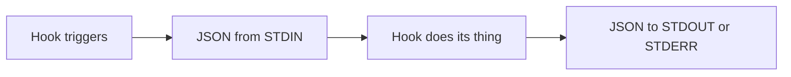

# Ruby DSL for Claude Code hooks

A Ruby DSL framework for creating Claude Code hooks. This will hopefully make creating and configuring new hooks way easier.

[**What does it bring?**](WHY.md)

## 🚀 Quick Start

> [!TIP]
> An example is available in [`example_dotclaude/hooks/`](example_dotclaude/hooks/)

Here's how to create a simple hook:

1. **Install the gem:**
```bash
  gem install claude_hooks
```

1. **Create a simple hook script**
```ruby
#!/usr/bin/env ruby
require 'claude_hooks'

# Inherit from the right hook type class to get access to helper methods
class AddContextAfterPrompt < ClaudeHooks::UserPromptSubmit
  def call
    log "User asked: #{prompt}"
    add_context!("Remember to be extra helpful!")
    output_data
  end
end

# Run the hook
if __FILE__ == $0
  # Read Claude Code's input data from STDIN
  input_data = JSON.parse(STDIN.read)

  hook = AddContextAfterPrompt.new(input_data)
  output = hook.call

  puts JSON.generate(output)
  exit 0
end
```

3. ⚠️ **Make it executable (and test it)**
```bash
chmod +x add_context_after_prompt.rb
echo '{"session_id":"test","prompt":"Hello!"}' | ruby add_context_after_prompt.rb
```

4. **Register it in your `.claude/settings.json`**
```json
{
  "hooks": {
    "UserPromptSubmit": [{
      "matcher": "",
      "hooks": [
        {
          "type": "command",
          "command": "path/to/your/hook.rb"
        }
      ]
    }]
  }
}
```
That's it! Your hook will now add context to every user prompt. 🎉

> [!TIP]
> This was a very simple example but we recommend using the entrypoints/handlers architecture [described below](#recommended-structure-for-your-claudehooks-directory) to create more complex hook systems.

## 📦 Installation

Add to your Gemfile (you can add a Gemfile in your `.claude` directory if needed):

```ruby
gem 'claude_hooks'
```

And then execute:

```bash
$ bundle install
```

Or install it globally:

```bash
$ gem install claude_hooks
```

### 🔧 Configuration

This gem uses either environment variables or a global configuration file.


#### Required Configuration Options

| Option | Description | Default |
|--------|-------------|---------|
| `baseDir` | Base directory for all Claude files | `~/.claude` |
| `logDirectory` | Directory for logs (relative to baseDir) | `logs` |

#### Environment Variables (Preferred)

The gem uses environment variables with the `RUBY_CLAUDE_HOOKS_` prefix for configuration:

```bash
export RUBY_CLAUDE_HOOKS_BASE_DIR="~/.claude"           # Default: ~/.claude
export RUBY_CLAUDE_HOOKS_LOG_DIR="logs"                 # Default: logs (relative to base_dir)

# You can add any custom configuration
export RUBY_CLAUDE_HOOKS_API_KEY="your-api-key"
export RUBY_CLAUDE_HOOKS_DEBUG_MODE="true"
export RUBY_CLAUDE_HOOKS_USER_NAME="Gabriel"
```

#### Configuration File

You can choose to use a global configuration file by setting it up in `~/.claude/config/config.json`.
The gem will read from it as fallback for any missing environment variables.

```json
{
  "baseDir": "~/.claude",
  "logDirectory": "logs",
  "apiKey": "your-api-key",
  "debugMode": true,
  "userName": "Gabriel"
}
```

#### Accessing Custom Configuration

You can access any configuration value in your handlers:

```ruby
class MyHandler < ClaudeHooks::UserPromptSubmit
  def call
    # Access built-in config
    log "Base dir: #{config.base_dir}"
    log "Logs dir: #{config.logs_directory}"

    # Access custom config via method calls
    log "API Key: #{config.api_key}"
    log "Debug mode: #{config.debug_mode}"
    log "User: #{config.user_name}"

    # Or use get_config_value for more control
    user_name = config.get_config_value('USER_NAME', 'userName', )
    log "Username: #{user_name}"

    output_data
  end
end
```

**Configuration Priority:** Environment variables always take precedence over config file values.

## 📖 Table of Contents

- [Ruby DSL for Claude Code hooks](#ruby-dsl-for-claude-code-hooks)
  - [🚀 Quick Start](#-quick-start)
  - [📦 Installation](#-installation)
    - [🔧 Configuration](#-configuration)
      - [Required Configuration Options](#required-configuration-options)
      - [Environment Variables (Preferred)](#environment-variables-preferred)
      - [Configuration File](#configuration-file)
      - [Accessing Custom Configuration](#accessing-custom-configuration)
  - [📖 Table of Contents](#-table-of-contents)
  - [🏗️ Architecture](#️-architecture)
    - [Core Components](#core-components)
    - [Recommended structure for your .claude/hooks/ directory](#recommended-structure-for-your-claudehooks-directory)
  - [🪝 Hook Types](#-hook-types)
  - [🚀 Claude Hook Flow](#-claude-hook-flow)
    - [A very simplified view of how a hook works in Claude Code](#a-very-simplified-view-of-how-a-hook-works-in-claude-code)
    - [🔄 Claude Hook Execution Flow](#-claude-hook-execution-flow)
    - [Basic Hook Handler Structure](#basic-hook-handler-structure)
    - [Input Fields](#input-fields)
  - [📚 API Reference](#-api-reference)
    - [Common API Methods](#common-api-methods)
      - [Input Methods](#input-methods)
      - [Output Methods](#output-methods)
      - [Class Output Methods](#class-output-methods)
      - [Utility Methods](#utility-methods)
    - [UserPromptSubmit API](#userpromptsubmit-api)
      - [Input Methods](#input-methods-1)
      - [Output Methods](#output-methods-1)
    - [PreToolUse API](#pretooluse-api)
      - [Input Methods](#input-methods-2)
      - [Output Methods](#output-methods-2)
    - [PostToolUse API](#posttooluse-api)
      - [Input Methods](#input-methods-3)
      - [Output Methods](#output-methods-3)
    - [Notification API](#notification-api)
      - [Input Methods](#input-methods-4)
      - [Output Methods](#output-methods-4)
    - [Stop API](#stop-api)
      - [Input Methods](#input-methods-5)
      - [Output Methods](#output-methods-5)
    - [SubagentStop API](#subagentstop-api)
      - [Input Methods](#input-methods-6)
      - [Output Methods](#output-methods-6)
    - [PreCompact API](#precompact-api)
      - [Input Methods](#input-methods-7)
      - [Output Methods](#output-methods-7)
      - [Utility Methods](#utility-methods-1)
    - [SessionStart API](#sessionstart-api)
      - [Input Methods](#input-methods-8)
      - [Output Methods](#output-methods-8)
    - [Configuration and Utility Methods](#configuration-and-utility-methods)
      - [Configuration Methods](#configuration-methods)
      - [Utility Methods](#utility-methods-2)
    - [📝 Logging](#-logging)
      - [Log File Location](#log-file-location)
      - [Log Output Format](#log-output-format)
  - [📝 Example: Tool usage monitor](#-example-tool-usage-monitor)
  - [🔄 Hook Output](#-hook-output)
    - [🔄 Hook Output Merging](#-hook-output-merging)
    - [🚪 Hook Exit Codes](#-hook-exit-codes)
    - [Pattern 1: Simple Exit Codes](#pattern-1-simple-exit-codes)
    - [Example: Success](#example-success)
    - [Example: Error](#example-error)
  - [🚨 Advices](#-advices)
  - [⚠️ Troubleshooting](#️-troubleshooting)
    - [Make your entrypoint scripts executable](#make-your-entrypoint-scripts-executable)
  - [🐛 Debugging](#-debugging)
    - [Test an individual entrypoint](#test-an-individual-entrypoint)


## 🏗️ Architecture

### Core Components

1. **`ClaudeHooks::Base`** - Base class with common functionality (logging, config, validation)
2. **Hook Handler Classes** - Self-contained classes (`ClaudeHooks::UserPromptSubmit`, `ClaudeHooks::PreToolUse`, `ClaudeHooks::PostToolUse`, etc.)
3. **Logger** - Dedicated logging class with multiline block support
4. **Configuration** - Shared configuration management via `ClaudeHooks::Configuration`

### Recommended structure for your .claude/hooks/ directory

```
.claude/hooks/
├── entrypoints/                # Main entry points
│   ├── notification.rb
│   ├── pre_tool_use.rb
│   ├── post_tool_use.rb
│   ├── pre_compact.rb
│   ├── session_start.rb
│   ├── stop.rb
│   └── subagent_stop.rb
|
└── handlers/                    # Hook handlers for specific hook type
    ├── user_prompt_submit/
    │   ├── append_rules.rb
    │   └── log_user_prompt.rb
    ├── pre_tool_use/
    │   └── tool_monitor.rb
    └── ...
```

## 🪝 Hook Types

The framework supports the following hook types:

| Hook Type | Class | Description |
|-----------|-------|-------------|
| **SessionStart** | `ClaudeHooks::SessionStart` | Hooks that run when Claude Code starts a new session or resumes |
| **UserPromptSubmit** | `ClaudeHooks::UserPromptSubmit` | Hooks that run before the user's prompt is processed |
| **Notification** | `ClaudeHooks::Notification` | Hooks that run when Claude Code sends notifications |
| **PreToolUse** | `ClaudeHooks::PreToolUse` | Hooks that run before a tool is used |
| **PostToolUse** | `ClaudeHooks::PostToolUse` | Hooks that run after a tool is used |
| **Stop** | `ClaudeHooks::Stop` | Hooks that run when Claude Code finishes responding |
| **SubagentStop** | `ClaudeHooks::SubagentStop` | Hooks that run when subagent tasks complete |
| **PreCompact** | `ClaudeHooks::PreCompact` | Hooks that run before transcript compaction |

## 🚀 Claude Hook Flow

### A very simplified view of how a hook works in Claude Code



### 🔄 Claude Hook Execution Flow

1. An entrypoint for a hook is set in `~/.claude/settings.json`
2. Claude Code calls the entrypoint script (e.g., `hooks/entrypoints/pre_tool_use.rb`)
3. The entrypoint script reads STDIN and coordinates multiple **hook handlers**
4. Each **hook handler** executes and returns its output data
5. The entrypoint script combines/processes outputs from multiple **hook handlers**
6. And then returns final JSON response to Claude Code

```mermaid
graph TD
  A[🔧 Hook Configuration<br/>settings.json] --> B
  B[🤖 Claude Code<br/><em>User submits prompt</em>] --> C[📋 Entrypoint<br />entrypoints/user_prompt_submit.rb]

  C --> D[📋 Entrypoint<br />Parses JSON from STDIN]
  D --> E[📋 Entrypoint<br />Calls hook handlers]

  E --> F[📝 AppendContextRules.call<br/><em>Returns output_data</em>]
  E --> G[📝 PromptGuard.call<br/><em>Returns output_data</em>]

  F --> J[📋 Entrypoint<br />Calls _ClaudeHooks::UserPromptSubmit.merge_outputs_ to 🔀 merge outputs]
  G --> J

  J --> K[📋 Entrypoint<br />Outputs JSON to STDOUT or STDERR]
  K --> L[🤖 Yields back to Claude Code]
  L --> B
```



### Basic Hook Handler Structure

```ruby
#!/usr/bin/env ruby

require 'claude_hooks'

class AddContextAfterPrompt < ClaudeHooks::UserPromptSubmit
  def call
    # Access input data
    log do
      "--- INPUT DATA ---"
      "session_id: #{session_id}"
      "cwd: #{cwd}"
      "hook_event_name: #{hook_event_name}"
      "prompt: #{current_prompt}"
      "---"
    end

    log "Full conversation transcript: #{read_transcript}"

    add_additional_context!("Some custom context")

    # Block the prompt
    if current_prompt.include?("bad word")
      block_prompt!("Hmm no no no!")
      log "Prompt blocked: #{current_prompt} because of bad word"
    end

    # Return output data
    output_data
  end
end
```

### Input Fields

The framework supports all existing hook types with their respective input fields:

| Hook Type | Input Fields |
|-----------|--------------|
| **Common**  | `session_id`, `transcript_path`, `cwd`, `hook_event_name` |
| **UserPromptSubmit**  | `prompt` |
| **PreToolUse**  | `tool_name`, `tool_input` |
| **PostToolUse**  | `tool_name`, `tool_input`, `tool_response` |
| **Notification**  | `message` |
| **Stop**  | `stop_hook_active` |
| **SubagentStop**  | `stop_hook_active` |
| **PreCompact**  | `trigger`, `custom_instructions` |
| **SessionStart**  | `source` |

## 📚 API Reference

The whole purpose of those APIs is to simplify reading from STDIN and writing to STDOUT the way Claude Code expects you to.

### Common API Methods

Those methods are available in **all hook types** and are inherited from `ClaudeHooks::Base`:

#### Input Methods
Input methods are helpers to access data parsed from STDIN.

| Method | Description |
|--------|-------------|
| `input_data` | Input data reader |
| `session_id` | Get the current session ID |
| `transcript_path` | Get path to the transcript file |
| `cwd` | Get current working directory |
| `hook_event_name` | Get the hook event name |
| `read_transcript` | Read the transcript file |
| `transcript` | Alias for `read_transcript` |

#### Output Methods
Output methods are helpers to modify `output_data`.

| Method | Description |
|--------|-------------|
| `output_data` | Output data accessor |
| `stringify_output` | Generates a JSON string from `output_data` |
| `allow_continue!` | Allow Claude to continue (default) |
| `prevent_continue!(reason)` | Stop Claude with reason |
| `suppress_output!` | Hide stdout from transcript |
| `show_output!` | Show stdout in transcript (default) |
| `clear_specifics!` | Clear hook-specific output |

#### Class Output Methods

Each hook type provides a **class method** `merge_outputs` that will try to intelligently merge multiple hook results, e.g. `ClaudeHooks::UserPromptSubmit.merge_outputs(output1, output2, output3)`.

| Method | Description |
|--------|-------------|
| `merge_outputs(*outputs_data)` | Intelligently merge multiple outputs into a single output |

#### Utility Methods
| Method | Description |
|--------|-------------|
| `log(message, level: :info)` | Log to session-specific file (levels: :info, :warn, :error) |

### UserPromptSubmit API

Available when inheriting from `ClaudeHooks::UserPromptSubmit`:

#### Input Methods
| Method | Description |
|--------|-------------|
| `prompt` | Get the user's prompt text |
| `user_prompt` | Alias for `prompt` |
| `current_prompt` | Alias for `prompt` |

#### Output Methods
| Method | Description |
|--------|-------------|
| `add_additional_context!(context)` | Add context to the prompt |
| `add_context!(context)` | Alias for `add_additional_context!` |
| `empty_additional_context!` | Remove additional context |
| `block_prompt!(reason)` | Block the prompt from processing |
| `unblock_prompt!` | Unblock a previously blocked prompt |

### PreToolUse API

Available when inheriting from `ClaudeHooks::PreToolUse`:

#### Input Methods
| Method | Description |
|--------|-------------|
| `tool_name` | Get the name of the tool being used |
| `tool_input` | Get the input data for the tool |

#### Output Methods
| Method | Description |
|--------|-------------|
| `approve_tool!(reason)` | Explicitly approve tool usage |
| `block_tool!(reason)` | Block tool usage with feedback |
| `ask_for_permission!(reason)` | Request user permission |

### PostToolUse API

Available when inheriting from `ClaudeHooks::PostToolUse`:

#### Input Methods
| Method | Description |
|--------|-------------|
| `tool_name` | Get the name of the tool that was used |
| `tool_input` | Get the input that was passed to the tool |
| `tool_response` | Get the tool's response/output |

#### Output Methods
| Method | Description |
|--------|-------------|
| `block_tool!(reason)` | Block the tool result from being used |
| `approve_tool!(reason)` | Clear any previous block decision (allows tool result) |

### Notification API

Available when inheriting from `ClaudeHooks::Notification`:

#### Input Methods
| Method | Description |
|--------|-------------|
| `message` | Get the notification message content |
| `notification_message` | Alias for `message` |

#### Output Methods
Notifications are outside facing and do not have any specific output methods.

### Stop API

Available when inheriting from `ClaudeHooks::Stop`:

#### Input Methods
| Method | Description |
|--------|-------------|
| `stop_hook_active` | Check if Claude Code is already continuing as a result of a stop hook |

#### Output Methods
| Method | Description |
|--------|-------------|
| `continue_with_instructions!(instructions)` | Block Claude from stopping and provide instructions to continue |
| `block!(instructions)` | Alias for `continue_with_instructions!` |
| `ensure_stopping!` | Allow Claude to stop normally (default behavior) |

### SubagentStop API

Available when inheriting from `ClaudeHooks::SubagentStop` (inherits from `ClaudeHooks::Stop`):

#### Input Methods
| Method | Description |
|--------|-------------|
| `stop_hook_active` | Check if Claude Code is already continuing as a result of a stop hook |

#### Output Methods
| Method | Description |
|--------|-------------|
| `continue_with_instructions!(instructions)` | Block Claude from stopping and provide instructions to continue |
| `block!(instructions)` | Alias for `continue_with_instructions!` |
| `ensure_stopping!` | Allow Claude to stop normally (default behavior) |

### PreCompact API

Available when inheriting from `ClaudeHooks::PreCompact`:

#### Input Methods
| Method | Description |
|--------|-------------|
| `trigger` | Get the compaction trigger: `'manual'` or `'auto'` |
| `custom_instructions` | Get custom instructions (only available for manual trigger) |

#### Output Methods
No specific output methods are available to alter compaction behavior.

#### Utility Methods
| Method | Description |
|--------|-------------|
| `backup_transcript!(backup_file_path)` | Create a backup of the transcript at the specified path |

### SessionStart API

Available when inheriting from `ClaudeHooks::SessionStart`:

#### Input Methods
| Method | Description |
|--------|-------------|
| `source` | Get the session start source: `'startup'`, `'resume'`, or `'clear'` |

#### Output Methods
| Method | Description |
|--------|-------------|
| `add_additional_context!(context)` | Add contextual information for Claude's session |
| `add_context!(context)` | Alias for `add_additional_context!` |
| `empty_additional_context!` | Clear additional context |

### Configuration and Utility Methods

Available in all hooks via the base `ClaudeHooks::Base` class:

#### Configuration Methods
| Method | Description |
|--------|-------------|
| `base_dir` | Get the base Claude directory |
| `path_for(relative_path)` | Get absolute path relative to base dir |
| `config` | Access the full configuration object |
| `config.get_config_value(env_key, config_key, default)` | Get any config value with fallback |
| `config.logs_directory` | Get logs directory path |
| `config.your_custom_key` | Access any custom config via method_missing |

#### Utility Methods
| Method | Description |
|--------|-------------|
| `log(message, level: :info)` | Log to session-specific file (levels: :info, :warn, :error) |
| `log(level: :info) { block }` | Multiline logging with block support |

### 📝 Logging

`ClaudeHooks::Base` provides a **session logger** that will write logs to session-specific files.

```ruby
log "Simple message"
log "Error occurred", level: :error
log "Warning about something", level: :warn

log <<~TEXT
  Configuration loaded successfully
  Database connection established
  System ready
TEXT
```

#### Log File Location
Logs are written to session-specific files in the configured log directory:
- **Defaults to**: `~/.claude/logs/hooks/session-{session_id}.log`
- **Configurable path**: Set via `config.json` → `logDirectory` or via `RUBY_CLAUDE_HOOKS_LOG_DIR` environment variable

#### Log Output Format
```
[2025-08-16 03:45:28] [INFO] [MyHookHandler] Starting execution
[2025-08-16 03:45:28] [ERROR] [MyHookHandler] Connection timeout
```

## 📝 Example: Tool usage monitor

Let's create a hook that will monitor tool usage and ask for permission before using dangerous tools.

First, register an entrypoint in `~/.claude/settings.json`:

```json
"hooks": {
  "PreToolUse": [
    {
      "matcher": "",
      "hooks": [
        {
          "type": "command",
          "command": "~/.claude/hooks/entrypoints/pre_tool_use.rb"
        }
      ]
    }
  ],
}
```

Then, create your main entrypoint script and don't forget to make it executable:
```bash
touch ~/.claude/hooks/entrypoints/pre_tool_use.rb
chmod +x ~/.claude/hooks/entrypoints/pre_tool_use.rb
```

```ruby
#!/usr/bin/env ruby

require 'json'
require_relative '../handlers/pre_tool_use/tool_monitor'

begin
  # Read input from stdin
  input_data = JSON.parse(STDIN.read)

  tool_monitor = ToolMonitor.new(input_data)
  output = tool_monitor.call

  # Any other hook scripts can be chained here

  puts JSON.generate(output)

rescue JSON::ParserError => e
  log "Error parsing JSON: #{e.message}", level: :error
  puts JSON.generate({
    continue: false,
    stopReason: "JSON parsing error: #{e.message}",
    suppressOutput: false
  })
  exit 0
rescue StandardError => e
  log "Error in ToolMonitor hook: #{e.message}", level: :error
  puts JSON.generate({
    continue: false,
    stopReason: "Hook execution error: #{e.message}",
    suppressOutput: false
  })
  exit 0
end
```

Finally, create the handler that will be used to monitor tool usage.

```bash
touch ~/.claude/hooks/handlers/pre_tool_use/tool_monitor.rb
```

```ruby
#!/usr/bin/env ruby

require 'claude_hooks'

class ToolMonitor < ClaudeHooks::PreToolUse
  DANGEROUS_TOOLS = %w[curl wget rm].freeze

  def call
    log "Monitoring tool usage: #{tool_name}"

    if DANGEROUS_TOOLS.include?(tool_name)
      log "Dangerous tool detected: #{tool_name}", level: :warn
      ask_for_permission!("The tool '#{tool_name}' can impact your system. Allow?")
    else
      approve_tool!("Safe tool usage")
    end

    output_data
  end
end
```

## 🔄 Hook Output

### 🔄 Hook Output Merging

Each hook script type provides a merging method `merge_outputs` that will try to intelligently merge multiple hook results:

```ruby
# Merge results from multiple UserPromptSubmit hooks
merged_result = ClaudeHooks::UserPromptSubmit.merge_outputs(output1, output2, output3)

# ClaudeHooks::UserPromptSubmit.merge_outputs follows the following merge logic:
# - continue: false wins (any hook script can stop execution)
# - suppressOutput: true wins (any hook script can suppress output)
# - decision: "block" wins (any hook script can block)
# - stopReason/reason: concatenated
# - additionalContext: joined
```

### 🚪 Hook Exit Codes

Claude Code hooks support multiple exit codes:

### Pattern 1: Simple Exit Codes
- **`exit 0`**: Success, allow the operation to continue
- **`exit 1`**: Non-blocking error, `STDERR` will be fed back to the user
- **`exit 2`**: Blocking error, `STDERR` will be fed back to Claude

**Hook-specific meanings:**
- **UserPromptSubmit**: `exit 1` blocks the prompt from being processed
- **PreToolUse**: `exit 1` blocks the tool, `exit 2` asks for permission
- **PostToolUse**: `exit 1` blocks the tool result from being used


### Example: Success
For the operation to continue for a UserPromptSubmit hook, you would return structured JSON data followed by `exit 0`:

```ruby
puts JSON.generate({
  continue: true,
  stopReason: "",
  suppressOutput: false,
  hookSpecificOutput: {
    hookEventName: "UserPromptSubmit",
    additionalContext: "context here"
  }
})
exit 0
```

### Example: Error

For the operation to stop for a UserPromptSubmit hook, you would return structured JSON data followed by `exit 1`:

```ruby
$stderr.puts JSON.generate({
  continue: false,
  stopReason: "JSON parsing error: #{e.message}",
  suppressOutput: false
})
exit 1
```

> [!WARNING]
> Don't forget to use `$stderr.puts` to output the JSON to STDERR.


## 🚨 Advices

1. **Logging**: Use `log()` method instead of `puts` to avoid interfering with JSON output
2. **Error Handling**: Hooks should handle their own errors and use the `log` method for debugging. For errors, don't forget to exit with the right exit code (1, 2) and output the JSON indicating the error to STDERR using `$stderr.puts`.
3. **Output Format**: Always return `output_data` or `nil` from your `call` method
4. **Path Management**: Use `path_for()` for all file operations relative to the Claude base directory

## ⚠️ Troubleshooting

### Make your entrypoint scripts executable

Don't forget to make the scripts called from `settings.json` executable:

```bash
chmod +x ~/.claude/hooks/entrypoints/user_prompt_submit.rb
```


## 🐛 Debugging

### Test an individual entrypoint

```bash
# Test with sample data
echo '{"session_id": "test", "transcript_path": "/tmp/transcript", "cwd": "/tmp", "hook_event_name": "UserPromptSubmit", "user_prompt": "Hello Claude"}' | ruby ~/.claude/hooks/entrypoints/user_prompt_submit.rb
```
