# Ruby DSL for Claude Code hooks

A Ruby DSL framework for creating Claude Code hooks. This will hopefully make creating and configuring new hooks way easier.

[**What does it bring?**](WHY.md)

## 🚀 Quick Start

> [!NOTE]
> An example is available in [`example_dotclaude/hooks/`](example_dotclaude/hooks/).

Here's how to create your first hook:

1. **Install the gem:**
```bash
  gem install claude_hooks
```

1. **Create a simple hook script**
```ruby
#!/usr/bin/env ruby
require 'claude_hooks'

# Inherit from the right hook type class to get access to helper methods
class AddContextAfterPrompt < ClaudeHooks::UserPromptSubmit
  def call
    log "User asked: #{prompt}"
    add_context!("Remember to be extra helpful!")
    output_data
  end
end

# Run the hook
if __FILE__ == $0
  # Read Claude Code's input data from STDIN
  input_data = JSON.parse(STDIN.read)

  hook = AddContextAfterPrompt.new(input_data)
  output = hook.call

  puts JSON.generate(output)
  exit 0
end
```

3. ⚠️ **Make it executable (and test it)**
```bash
chmod +x add_context_after_prompt.rb
echo '{"session_id":"test","prompt":"Hello!"}' | ruby add_context_after_prompt.rb
```

4. **Register it in your `.claude/settings.json`**
```json
{
  "hooks": {
    "UserPromptSubmit": [{
      "matcher": "",
      "hooks": [
        {
          "type": "command",
          "command": "path/to/your/hook.rb"
        }
      ]
    }]
  }
}
```

That's it! Your hook will now add context to every user prompt. 🎉

## 📦 Installation

Add to your Gemfile:

```ruby
gem 'claude_hooks'
```

And then execute:

```bash
$ bundle install
```

Or install it globally:

```bash
$ gem install claude_hooks
```

### 🔧 Configuration

This gem uses either environment variables or a global configuration file.

#### Environment Variables (Preferred)

The gem uses environment variables with the `RUBY_CLAUDE_CODE_` prefix for configuration:

```bash
export RUBY_CLAUDE_CODE_BASE_DIR="~/.claude"           # Default: ~/.claude
export RUBY_CLAUDE_CODE_LOG_DIR="logs"                 # Default: logs (relative to base_dir)
export RUBY_CLAUDE_CODE_USER_NAME="YourName"
```

#### Configuration File

You can choose to use a global configuration file by setting it up in `~/.claude/config/config.json`.
The gem will read from it as fallback for any missing environment variables.

```json
{
  "baseDir": "~/.claude",
  "logDirectory": "logs",
  "userName": "Gaby"
}
```

- [Ruby DSL for Claude Code hooks](#ruby-dsl-for-claude-code-hooks)
  - [🚀 Quick Start](#-quick-start)
  - [📦 Installation](#-installation)
    - [🔧 Configuration](#-configuration)
      - [Environment Variables (Preferred)](#environment-variables-preferred)
      - [Configuration File](#configuration-file)
  - [🏗️ Architecture](#️-architecture)
    - [Core Components](#core-components)
    - [Architecture](#architecture)
  - [🪝 Hook Types](#-hook-types)
  - [🚀 Creating Hook Scripts](#-creating-hook-scripts)
    - [🔄 Hook Execution Flow](#-hook-execution-flow)
    - [Basic Hook Script Structure](#basic-hook-script-structure)
    - [Hook Types and Input Fields](#hook-types-and-input-fields)
  - [📚 API Reference](#-api-reference)
    - [Common API Methods](#common-api-methods)
      - [Input Methods](#input-methods)
      - [Output Methods](#output-methods)
      - [Utility Methods](#utility-methods)
    - [UserPromptSubmit API](#userpromptsubmit-api)
      - [Input Methods](#input-methods-1)
      - [Output Methods](#output-methods-1)
    - [PreToolUse API](#pretooluse-api)
      - [Input Methods](#input-methods-2)
      - [Output Methods](#output-methods-2)
    - [PostToolUse API](#posttooluse-api)
      - [Input Methods](#input-methods-3)
      - [Output Methods](#output-methods-3)
    - [Notification API](#notification-api)
      - [Input Methods](#input-methods-4)
      - [Output Methods](#output-methods-4)
    - [Stop API](#stop-api)
      - [Input Methods](#input-methods-5)
      - [Output Methods](#output-methods-5)
    - [SubagentStop API](#subagentstop-api)
      - [Input Methods](#input-methods-6)
      - [Output Methods](#output-methods-6)
    - [PreCompact API](#precompact-api)
      - [Input Methods](#input-methods-7)
      - [Output Methods](#output-methods-7)
      - [Utility Methods](#utility-methods-1)
    - [SessionStart API](#sessionstart-api)
      - [Input Methods](#input-methods-8)
      - [Output Methods](#output-methods-8)
    - [Configuration and Utility Methods](#configuration-and-utility-methods)
      - [Configuration Methods](#configuration-methods)
      - [Utility Methods](#utility-methods-2)
    - [📝 Logging](#-logging)
      - [Log File Location](#log-file-location)
      - [Log Output Format](#log-output-format)
    - [🔄 Hook Output Merging](#-hook-output-merging)
  - [📝 Example: Tool usage monitor](#-example-tool-usage-monitor)
  - [🔧 Configuration](#-configuration-1)
    - [Configuration File](#configuration-file-1)
      - [Configuration Options](#configuration-options)
    - [Registering Hooks](#registering-hooks)
  - [🔄 Hook Output Patterns](#-hook-output-patterns)
    - [Pattern 1: Simple Exit Codes](#pattern-1-simple-exit-codes)
    - [Pattern 2: JSON Output + exit 0 (Recommended)](#pattern-2-json-output--exit-0-recommended)
  - [🚨 Advices](#-advices)
  - [⚠️ Troubleshooting](#️-troubleshooting)
    - [Make your scripts executable](#make-your-scripts-executable)
  - [🐛 Debugging](#-debugging)
    - [Test Individual Hooks](#test-individual-hooks)


## 🏗️ Architecture

### Core Components

1. **`HookTypes::Base`** - Base class with common functionality (logging, config, validation)
2. **Hook Type Classes** - Self-contained classes in `hook_types/` (`UserPromptSubmitHook`, `PreToolUseHook`, `PostToolUseHook`)
3. **SessionLogger** - Dedicated logging class with multiline block support
4. **Config Management** - Shared configuration management via `ClaudeConfig::ConfigLoader` (see `config/config.json`)

### Architecture

```
hooks
├── README.md
├── hook_scripts/
│   ├── utils/
│   |    └── session_logger.rb           # Session-based logging
|   |
│   ├── hook_types/                      # Helper classes per hook type
│   │   ├── base.rb                      # Base HookTypes::Base class
│   │   ├── notification_hook.rb
│   │   ├── post_tool_use_hook.rb
│   │   ├── pre_compact_hook.rb
│   │   ├── pre_tool_use_hook.rb
│   │   ├── session_start_hook.rb
│   │   ├── stop_hook.rb
│   │   ├── subagent_stop_hook.rb
│   │   └── user_prompt_submit_hook.rb
|   |
│   ├── post_tool_use_scripts/           # Hook scripts for specific hook type
│   │   └── some_script.rb
|   ├── ...
│   └── user_prompt_submit_scripts/      # Hook scripts for specific hook type
│       └── some_other_script.rb
|
├── notification.rb                     # Main entry point for specific hook type
└── user_prompt_submit.rb               # Main entry point for specific hook type
```

## 🪝 Hook Types

The framework supports the following hook types:

| Hook Type | Description |
|-----------|-------------|
| **UserPromptSubmit** | Hooks that run before the user's prompt is processed |
| **PreToolUse** | Hooks that run before a tool is used |
| **PostToolUse** | Hooks that run after a tool is used |
| **Notification** | Hooks that run when Claude Code sends notifications |
| **Stop** | Hooks that run when Claude Code finishes responding |
| **SubagentStop** | Hooks that run when subagent tasks complete |
| **PreCompact** | Hooks that run before transcript compaction |
| **SessionStart** | Hooks that run when Claude Code starts a new session or resumes |

## 🚀 Creating Hook Scripts

### 🔄 Hook Execution Flow

1. Claude Code calls a main entrypoint script (e.g., `pre_tool_use.rb`)
2. Entrypoint script reads JSON input and coordinates multiple **hook scripts**
3. Each **hook script** executes and returns its output data
4. Entrypoint script combines/processes outputs from multiple **hook scripts**
5. Entrypoint script returns final JSON response to Claude Code

```mermaid
graph TD
  A["settings.json<br/>🔧 Hook Configuration"] --> B
  B[Claude Code<br/><em>User submits prompt</em>] --> C["user_prompt_submit.rb<br/>📋 Main Entry Point"]

  C --> D["Parse JSON from STDIN"]
  D --> E["📝 Run hook Scripts"]

  E --> F["📝 AppendContextRules.call<br/><em>Returns output_data</em>"]
  E --> G["📝 PromptGuard.call<br/><em>Returns output_data</em>"]

  F --> J["UserPromptSubmitHook.merge_outputs<br/>🔀 Merge Results"]
  G --> J

  J --> K["JSON output to Claude Code<br/><em>Claude Code continues</em>"]

  style A fill:#e1f5fe stroke:#000
  style C fill:#e8f5e8 stroke:#000
  style J fill:#fff3e0 stroke:#000
  style K fill:#e1f5fe stroke:#000
```



### Basic Hook Script Structure

```ruby
#!/usr/bin/env ruby

require 'claude_hooks'

class MyHookScript < ClaudeHooks::UserPromptSubmit
  def call
    # Access input data
    log "Transcript: #{read_transcript}"
    log do
      "--- INPUT DATA ---"
      "session_id: #{session_id}"
      "cwd: #{cwd}"
      "hook_event_name: #{hook_event_name}"
      "prompt: #{current_prompt}"
      "---"
    end

    add_additional_context!("Custom context added by MyHook")

    # Block the prompt
    if current_prompt.include?("bad word")
      block_prompt!("Hmm no no no!")
      log "Prompt blocked: #{current_prompt} because of bad word"
    end

    # Return output data
    output_data
  end
end
```

### Hook Types and Input Fields

The framework supports the following hook types with their respective input fields:

| Hook Type | Input Fields |
|-----------|--------------|
| **Common**  | `session_id`, `transcript_path`, `cwd`, `hook_event_name` |
| **UserPromptSubmit**  | `prompt` |
| **PreToolUse**  | `tool_name`, `tool_input` |
| **PostToolUse**  | `tool_name`, `tool_input`, `tool_response` |
| **Notification**  | `message` |
| **Stop**  | `stop_hook_active` |
| **SubagentStop**  | `stop_hook_active` |
| **PreCompact**  | `trigger`, `custom_instructions` |
| **SessionStart**  | `source` |

## 📚 API Reference

### Common API Methods

Available in all hook types through `HookScriptBase`:

#### Input Methods
| Method | Description |
|--------|-------------|
| `session_id` | Get the current session ID |
| `transcript_path` | Get path to the transcript file |
| `cwd` | Get current working directory |
| `hook_event_name` | Get the hook event name |
| `read_transcript` | Read the transcript file |
| `transcript` | Alias for `read_transcript` |

#### Output Methods
| Method | Description |
|--------|-------------|
| `allow_continue!` | Allow Claude to continue (default) |
| `prevent_continue!(reason)` | Stop Claude with reason |
| `suppress_output!` | Hide stdout from transcript |
| `show_output!` | Show stdout in transcript (default) |

#### Utility Methods
| Method | Description |
|--------|-------------|
| `clear_specifics!` | Clear hook-specific output |

### UserPromptSubmit API

Available when inheriting from `UserPromptSubmitHook`:

#### Input Methods
| Method | Description |
|--------|-------------|
| `prompt` | Get the user's prompt text |
| `user_prompt` | Alias for `prompt` |
| `current_prompt` | Alias for `prompt` |

#### Output Methods
| Method | Description |
|--------|-------------|
| `add_additional_context!(context)` | Add context to the prompt |
| `add_context!(context)` | Alias for `add_additional_context!` |
| `empty_additional_context!` | Remove additional context |
| `block_prompt!(reason)` | Block the prompt from processing |
| `unblock_prompt!` | Unblock a previously blocked prompt |

### PreToolUse API

Available when inheriting from `PreToolUseHook`:

#### Input Methods
| Method | Description |
|--------|-------------|
| `tool_name` | Get the name of the tool being used |
| `tool_input` | Get the input data for the tool |

#### Output Methods
| Method | Description |
|--------|-------------|
| `approve_tool!(reason)` | Explicitly approve tool usage |
| `block_tool!(reason)` | Block tool usage with feedback |
| `ask_for_permission!(reason)` | Request user permission |

### PostToolUse API

Available when inheriting from `PostToolUseHook`:

#### Input Methods
| Method | Description |
|--------|-------------|
| `tool_name` | Get the name of the tool that was used |
| `tool_input` | Get the input that was passed to the tool |
| `tool_response` | Get the tool's response/output |

#### Output Methods
| Method | Description |
|--------|-------------|
| `block_tool!(reason)` | Block the tool result from being used |
| `approve_tool!(reason)` | Clear any previous block decision (allows tool result) |

### Notification API

Available when inheriting from `NotificationHook`:

#### Input Methods
| Method | Description |
|--------|-------------|
| `message` | Get the notification message content |
| `notification_message` | Alias for `message` |

#### Output Methods
Notifications are outside facing and do not have any specific output methods.

### Stop API

Available when inheriting from `StopHook`:

#### Input Methods
| Method | Description |
|--------|-------------|
| `stop_hook_active` | Check if Claude Code is already continuing as a result of a stop hook |

#### Output Methods
| Method | Description |
|--------|-------------|
| `continue_with_instructions!(instructions)` | Block Claude from stopping and provide instructions to continue |
| `block!(instructions)` | Alias for `continue_with_instructions!` |
| `ensure_stopping!` | Allow Claude to stop normally (default behavior) |

### SubagentStop API

Available when inheriting from `SubagentStopHook` (inherits from `StopHook`):

#### Input Methods
| Method | Description |
|--------|-------------|
| `stop_hook_active` | Check if Claude Code is already continuing as a result of a stop hook |

#### Output Methods
| Method | Description |
|--------|-------------|
| `continue_with_instructions!(instructions)` | Block Claude from stopping and provide instructions to continue |
| `block!(instructions)` | Alias for `continue_with_instructions!` |
| `ensure_stopping!` | Allow Claude to stop normally (default behavior) |

### PreCompact API

Available when inheriting from `PreCompactHook`:

#### Input Methods
| Method | Description |
|--------|-------------|
| `trigger` | Get the compaction trigger: `'manual'` or `'auto'` |
| `custom_instructions` | Get custom instructions (only available for manual trigger) |

#### Output Methods
No specific output methods are available to alter compaction behavior.

#### Utility Methods
| Method | Description |
|--------|-------------|
| `backup_transcript!(backup_file_path)` | Create a backup of the transcript at the specified path |

### SessionStart API

Available when inheriting from `SessionStartHook`:

#### Input Methods
| Method | Description |
|--------|-------------|
| `source` | Get the session start source: `'startup'`, `'resume'`, or `'clear'` |

#### Output Methods
| Method | Description |
|--------|-------------|
| `add_additional_context!(context)` | Add contextual information for Claude's session |
| `add_context!(context)` | Alias for `add_additional_context!` |
| `empty_additional_context!` | Clear additional context |

### Configuration and Utility Methods

Available in all hooks via the base `HookScriptBase` class:

#### Configuration Methods
| Method | Description |
|--------|-------------|
| `base_dir` | Get the base Claude directory |
| `path_for(relative_path)` | Get absolute path relative to base dir |
| `config` | Access the full configuration object |

#### Utility Methods
| Method | Description |
|--------|-------------|
| `log(message, level: :info)` | Log to session-specific file (levels: :info, :warn, :error) |
| `log(level: :info) { block }` | Multiline logging with block support |

### 📝 Logging

HookScriptBase provides a **session logger** that will write logs to session-specific files.

```ruby
log "Simple message"
log "Error occurred", level: :error
log "Warning about something", level: :warn

log <<~TEXT
  Configuration loaded successfully
  Database connection established
  System ready
TEXT
```

#### Log File Location
Logs are written to session-specific files in the configured log directory:
- **Defaults to**: `~/.claude/logs/hooks/session-{session_id}.log`
- **Configurable path**: Set via `config.json` → `logDirectory` or via `RUBY_CLAUDE_CODE_LOG_DIR` environment variable

#### Log Output Format
```
[2025-08-16 03:45:28] [INFO] [MyHookScriptBase] Starting execution
[2025-08-16 03:45:28] [ERROR] [MyHookScriptBase] Connection timeout
```

### 🔄 Hook Output Merging

Each hook script type provides a merging method `merge_outputs` that will try to intelligently merge multiple hook results:

```ruby
# Merge results from multiple UserPromptSubmit hooks
merged_result = UserPromptSubmitHook.merge_outputs(output1, output2, output3)

# UserPromptSubmitHook merge_outputs follows the following merge logic:
# - continue: false wins (any hook script can stop execution)
# - suppressOutput: true wins (any hook script can suppress output)
# - decision: "block" wins (any hook script can block)
# - stopReason/reason: concatenated
# - additionalContext: joined
```

## 📝 Example: Tool usage monitor

First register a hook in `~/.claude/settings.json`:

```json
"hooks": {
  "PreToolUse": [
    {
      "matcher": "",
      "hooks": [
        {
          "type": "command",
          "command": "~/.claude/hooks/pre_tool_use.rb"
        }
      ]
    }
  ],
}
```

Then create a Hook Script that will be used to monitor tool usage.

```ruby
#!/usr/bin/env ruby

require 'claude_hooks'

class ToolMonitor < ClaudeHooks::PreToolUse
  DANGEROUS_TOOLS = %w[bash_exec file_delete system_command].freeze

  def call
    log "Monitoring tool usage: #{tool_name}"

    if DANGEROUS_TOOLS.include?(tool_name)
      log "Dangerous tool detected: #{tool_name}", level: :warn
      ask_for_permission!("The tool '#{tool_name}' can modify your system. Allow?")
    else
      approve_tool!("Safe tool usage")
    end

    output_data
  end
end
```

Finally create your main dispatcher script and don't forget to make it executable:
```
touch ~/.claude/hooks/pre_tool_use.rb
chmod +x ~/.claude/hooks/pre_tool_use.rb
```

```ruby
#!/usr/bin/env ruby

require 'json'
require_relative 'hook_scripts/tool_monitor'

begin
  # Read input from stdin
  input_data = JSON.parse(STDIN.read)

  tool_monitor = ToolMonitor.new(input_data)
  output = tool_monitor.call

  # Any other hook scripts can be chained here

  puts JSON.generate(output)

rescue JSON::ParserError => e
  log "Error parsing JSON: #{e.message}", level: :error
  puts JSON.generate({
    continue: false,
    stopReason: "JSON parsing error: #{e.message}",
    suppressOutput: false
  })
  exit 0
rescue StandardError => e
  log "Error in ToolMonitor hook: #{e.message}", level: :error
  puts JSON.generate({
    continue: false,
    stopReason: "Hook execution error: #{e.message}",
    suppressOutput: false
  })
  exit 0
end
```

## 🔧 Configuration

### Configuration File

The framework uses `~/.claude/config/config.json`:

```json
{
  "baseDir": "~/.claude",
  "logDirectory": "logs"
}
```

#### Configuration Options

| Option | Description | Default |
|--------|-------------|---------|
| `baseDir` | Base directory for all Claude files | `~/.claude` |
| `logDirectory` | Directory for logs (relative to baseDir) | `logs` |

### Registering Hooks

Register hooks in `~/.claude/settings.json`:

```json
{
  "hooks": {
    "UserPromptSubmit": [
      {
        "matcher": "",
        "hooks": [
          {
            "type": "command",
            "command": "~/.claude/hooks/user_prompt_submit.rb"
          }
        ]
      }
    ],
    "PreToolUse": [
      {
        "matcher": "Edit|MultiEdit",
        "hooks": [
          {
            "type": "command",
            "command": "~/.claude/hooks/pre_tool_use_on_edit.rb"
          }
        ]
      }
    ],

}
```

## 🔄 Hook Output Patterns

Claude Code hooks support two output patterns:

### Pattern 1: Simple Exit Codes
- **`exit 0`**: Success, allow the operation to continue
- **`exit 1`**: Non-blocking error, `STDERR` will be fed back to the user
- **`exit 2`**: Blocking error, `STDERR` will be fed back to Claude

**Hook-specific meanings:**
- **UserPromptSubmit**: `exit 1` blocks the prompt from being processed
- **PreToolUse**: `exit 1` blocks the tool, `exit 2` asks for permission
- **PostToolUse**: `exit 1` blocks the tool result from being used

### Pattern 2: JSON Output + exit 0 (Recommended)
Return structured JSON data followed by `exit 0`:

```ruby
puts JSON.generate({
  continue: true,
  stopReason: "",
  suppressOutput: false,
  hookSpecificOutput: {
    hookEventName: "UserPromptSubmit",
    additionalContext: "context here"
  }
})
exit 0
```


## 🚨 Advices

1. **Error Handling**: Hooks should handle their own errors and use the `log` method for debugging. For errors, don't forget to exit with the right exit code (0, 1, 2) and output the JSON indicating the error.
2. **Output Format**: Always return `output_data` or `nil` from your `call` method
3. **Path Management**: Use `path_for()` for all file operations relative to the Claude base directory
4. **Logging**: Use `log()` method instead of `puts` to avoid interfering with JSON output

## ⚠️ Troubleshooting

### Make your scripts executable

Don't forget to make the scripts called from `settings.json` executable:

```bash
chmod +x ~/.claude/hooks/user_prompt_submit.rb
```


## 🐛 Debugging

### Test Individual Hooks

```bash
# Test with sample data
echo '{"session_id": "test", "transcript_path": "/tmp/transcript", "cwd": "/tmp", "hook_event_name": "UserPromptSubmit", "user_prompt": "Hello Claude"}' | ruby your_hook.rb
```
