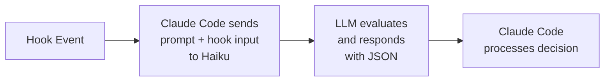

# Prompt-Based Hooks

Claude Code supports two types of hooks: **command hooks** and **prompt-based hooks**. This guide explains prompt-based hooks and how they differ from traditional command hooks.

## What are Prompt-Based Hooks?

Prompt-based hooks (`type: "prompt"`) delegate decision-making to an LLM (Haiku) instead of executing a bash command. When a hook event occurs, Claude Code sends your prompt and the hook input to the LLM, which responds with structured JSON containing a decision.

## How They Work



## Configuration

In your `.claude/settings.json`:

```json
{
  "hooks": {
    "Stop": [
      {
        "hooks": [
          {
            "type": "prompt",
            "prompt": "Evaluate if Claude should stop: $ARGUMENTS. Check if all tasks are complete.",
            "timeout": 30
          }
        ]
      }
    ]
  }
}
```

**Fields:**
- `type`: Must be `"prompt"` (vs. `"command"` for bash hooks)
- `prompt`: The prompt text to send to the LLM
  - Use `$ARGUMENTS` as a placeholder for the hook input JSON
  - If `$ARGUMENTS` is not present, input JSON is appended to the prompt
- `timeout`: (Optional) Timeout in seconds (default: 30)

## Response Schema

The LLM must respond with JSON containing:

```json
{
  "decision": "approve" | "block",
  "reason": "Explanation for the decision",
  "continue": false,  // Optional: stops Claude entirely
  "stopReason": "Message shown to user",  // Optional: custom stop message
  "systemMessage": "Warning or context"  // Optional: shown to user
}
```

**Response fields:**
- `decision`: `"approve"` allows the action, `"block"` prevents it
- `reason`: Explanation shown to Claude when decision is `"block"`
- `continue`: (Optional) If `false`, stops Claude's execution entirely
- `stopReason`: (Optional) Message shown when `continue` is false
- `systemMessage`: (Optional) Additional message shown to the user

## When to Use Prompt-Based Hooks

### ✅ Use Prompt-Based Hooks For:
- **Context-aware decisions** - When the decision requires understanding natural language or complex context
- **Intelligent evaluation** - Determining if a task is complete or if follow-up work is needed
- **Nuanced judgment** - Situations where simple rules aren't sufficient
- **Dynamic scenarios** - When decision criteria change based on the current context

### ❌ Use Command Hooks For:
- **Deterministic rules** - Simple, predictable logic (if X then Y)
- **Performance-critical operations** - When speed matters (command hooks are faster)
- **Security-sensitive checks** - When you need full control over the decision logic
- **Simple pattern matching** - Checking for specific strings, file patterns, etc.

## Comparison: Prompt-Based vs Command Hooks

| Feature | Command Hooks (`type: "command"`) | Prompt-Based Hooks (`type: "prompt"`) |
|---------|-----------------------------------|---------------------------------------|
| **Execution** | Runs bash script/Ruby code | Queries LLM (Haiku) |
| **Decision logic** | You implement in code | LLM evaluates context |
| **Setup complexity** | Requires script file | Configure prompt in settings |
| **Context awareness** | Limited to script logic | Natural language understanding |
| **Performance** | Fast (local execution) | Slower (API call to LLM) |
| **Determinism** | Fully predictable | May vary based on context |
| **Cost** | Free (local execution) | Uses API tokens |
| **Use case** | Deterministic rules | Context-aware decisions |

## Supported Hook Events

Prompt-based hooks work with any hook event, but are most useful for:

- **Stop**: Intelligently decide if Claude should continue working
- **SubagentStop**: Evaluate if a subagent has completed its task
- **UserPromptSubmit**: Validate user prompts with LLM assistance
- **PreToolUse**: Make context-aware permission decisions
- **PermissionRequest**: Intelligently allow or deny permission dialogs

## Examples

### Example 1: Intelligent Stop Hook

This prompt-based hook evaluates whether Claude should stop working by analyzing the conversation context:

```json
{
  "hooks": {
    "Stop": [
      {
        "hooks": [
          {
            "type": "prompt",
            "prompt": "You are evaluating whether Claude should stop working. Context: $ARGUMENTS\n\nAnalyze the conversation and determine if:\n1. All user-requested tasks are complete\n2. Any errors need to be addressed\n3. Follow-up work is needed\n\nRespond with JSON: {\"decision\": \"approve\" or \"block\", \"reason\": \"your explanation\"}",
            "timeout": 30
          }
        ]
      }
    ]
  }
}
```

**When to use:** When you want Claude to continue working if there are incomplete tasks or unresolved errors.

### Example 2: SubagentStop with Custom Logic

This hook evaluates whether a subagent has truly completed its assigned task:

```json
{
  "hooks": {
    "SubagentStop": [
      {
        "hooks": [
          {
            "type": "prompt",
            "prompt": "Evaluate if this subagent should stop. Input: $ARGUMENTS\n\nCheck if:\n- The subagent completed its assigned task\n- Any errors occurred that need fixing\n- Additional context gathering is needed\n\nReturn: {\"decision\": \"approve\" or \"block\", \"reason\": \"explanation\"}"
          }
        ]
      }
    ]
  }
}
```

**When to use:** When subagents might stop prematurely without fully completing their assigned work.

### Example 3: Context-Aware PreToolUse

This hook uses the LLM to make nuanced decisions about tool usage:

```json
{
  "hooks": {
    "PreToolUse": [
      {
        "matcher": "Bash|Write|Edit",
        "hooks": [
          {
            "type": "prompt",
            "prompt": "Evaluate this tool use for safety. Tool: $ARGUMENTS\n\nConsider:\n1. Is this a destructive operation?\n2. Does it modify critical files?\n3. Is this part of a reasonable workflow?\n\nRespond: {\"decision\": \"approve\" or \"block\", \"reason\": \"explanation\"}"
          }
        ]
      }
    ]
  }
}
```

**When to use:** When you want intelligent, context-aware safety checks beyond simple pattern matching.

## Hybrid Approach: Combining Both Hook Types

You can use both command hooks and prompt-based hooks together for the best of both worlds:

```json
{
  "hooks": {
    "PreToolUse": [
      {
        "matcher": "Bash",
        "hooks": [
          {
            "type": "command",
            "command": "~/.claude/hooks/entrypoints/bash_safety_check.rb"
          },
          {
            "type": "prompt",
            "prompt": "Review this bash command for safety: $ARGUMENTS\n\nIs this safe to execute? Respond with JSON."
          }
        ]
      }
    ]
  }
}
```

**Strategy:**
1. **Command hook first**: Fast, deterministic checks (pattern matching, blacklists)
2. **Prompt hook second**: Contextual evaluation for edge cases

This gives you both speed and intelligence!

## Using This Ruby DSL with Prompt-Based Hooks

**Important:** Since prompt-based hooks are executed by Claude Code (not your script), you **don't need to use this Ruby DSL for prompt-based hooks**. The DSL is specifically for `type: "command"` hooks.

However, you can still use command hooks that leverage LLMs if you want more control:

```ruby
#!/usr/bin/env ruby
require 'claude_hooks'
require 'anthropic'  # or other LLM client

class IntelligentStopHandler < ClaudeHooks::Stop
  def call
    # You have full control over the LLM interaction
    client = Anthropic::Client.new

    response = client.messages(
      model: "claude-haiku-4",
      messages: [{
        role: "user",
        content: "Analyze this transcript and decide if Claude should stop: #{read_transcript}"
      }]
    )

    # Process response and make decision
    if should_continue?(response)
      deny_stop!("More work needed")
    else
      approve_stop!("All tasks complete")
    end

    output
  end
end
```

**When to use command hooks with LLMs:**
- You need custom LLM interaction logic
- You want to use a different model or provider
- You need to combine LLM decisions with other logic
- You want full control over prompts and responses

## Best Practices

### 1. Be Specific in Prompts
**❌ Vague:**
```json
{
  "prompt": "Should this continue?"
}
```

**✅ Clear:**
```json
{
  "prompt": "Evaluate if Claude should stop working. Context: $ARGUMENTS\n\nCheck if:\n1. All user tasks are complete\n2. No errors remain\n3. No follow-up work is needed\n\nRespond with JSON: {\"decision\": \"approve\" or \"block\", \"reason\": \"explanation\"}"
}
```

### 2. Include Decision Criteria
Tell the LLM exactly what to consider:
- List specific factors to evaluate
- Provide examples of approve vs block scenarios
- Explain the context and purpose

### 3. Test Your Prompts
- Verify the LLM makes correct decisions for your use cases
- Test edge cases and ambiguous scenarios
- Adjust prompts based on results

### 4. Set Appropriate Timeouts
- Default is 30 seconds
- Increase for complex evaluations
- Decrease for simple checks

### 5. Use for Complex Decisions Only
- Bash hooks are better for simple, deterministic rules
- Prompt-based hooks excel at nuanced, context-aware decisions
- Consider the hybrid approach for best results

### 6. Consider Cost and Performance
- Each prompt-based hook call uses API tokens
- Command hooks are free and faster
- Use prompt hooks where the added intelligence justifies the cost

## Debugging Prompt-Based Hooks

Since prompt-based hooks are executed by Claude Code, debugging is different from command hooks:

### 1. Use `--debug` flag
```bash
claude --debug
```
This shows hook execution details in the Claude Code output.

### 2. Check Claude Code logs
Prompt-based hook decisions and LLM responses are logged by Claude Code.

### 3. Test your prompts separately
Before adding a prompt-based hook, test your prompt directly with the Claude API to ensure it responds correctly.

### 4. Start simple, then refine
Begin with a basic prompt, verify it works, then add complexity.

## Migration: From Command Hooks to Prompt-Based Hooks

### Before (Command Hook):
```ruby
#!/usr/bin/env ruby
require 'claude_hooks'

class StopEvaluator < ClaudeHooks::Stop
  def call
    transcript = read_transcript

    # Simple pattern matching
    if transcript.include?("all tasks complete")
      approve_stop!("Tasks done")
    else
      deny_stop!("Keep working")
    end

    output
  end
end
```

**Settings:**
```json
{
  "hooks": {
    "Stop": [{
      "hooks": [{
        "type": "command",
        "command": "~/.claude/hooks/stop_evaluator.rb"
      }]
    }]
  }
}
```

### After (Prompt-Based Hook):
```json
{
  "hooks": {
    "Stop": [
      {
        "hooks": [
          {
            "type": "prompt",
            "prompt": "Evaluate if Claude should stop. Context: $ARGUMENTS\n\nCheck if all user tasks are complete or if more work is needed.\n\nRespond: {\"decision\": \"approve\" or \"block\", \"reason\": \"explanation\"}"
          }
        ]
      }
    ]
  }
}
```

**Benefits of migration:**
- No Ruby script to maintain
- More intelligent, context-aware decisions
- Simpler configuration

**Tradeoffs:**
- Slower (API call)
- Uses API tokens
- Less deterministic

## Summary

Prompt-based hooks are a powerful addition to Claude Code that enable intelligent, context-aware decision-making. Use them when:
- Simple rules aren't sufficient
- You need natural language understanding
- Context and nuance matter

For everything else, stick with fast, deterministic command hooks or use this Ruby DSL for full control!
